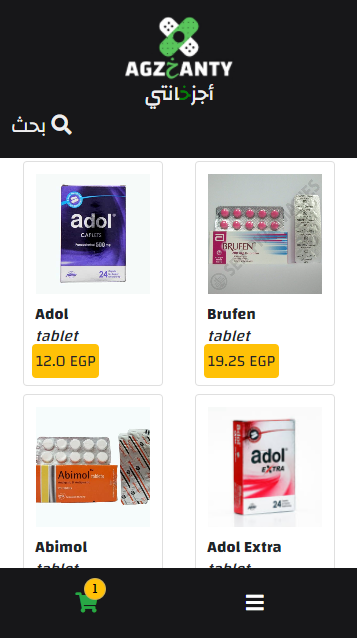
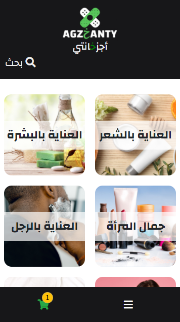
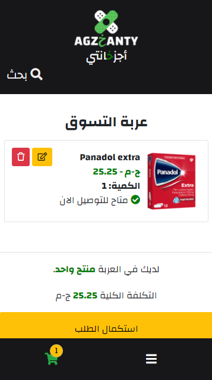

# PHARMACY APP

This project is a pharmacy delivery application that allows users get medications and cosmetics from the pharmacy. It's built mainly with Ruby on Rails.

In this project:

- Made models for medications, categories, and cosmetics.
- Made relationships between tables.
- Made validations for user inputs.
- Made a completely new design for the app using CSS3 and Bootstrap.
- Handled errors.
- Deployed the application to heroku app.

## Live Demo

[LIVE!](https://agz5anty.herokuapp.com/)

## Usage

- Clone the repo "https://github.com/Mohamed-js/Agz5anty.git"
- run "npm install"
- run "rails s"
- open the localhost server in the browser as shown in the cmd.

## Technologies

- Ruby On Rails
- Ruby
- Webpack
- Javascript
- VSCode

## Author

👤 **Mohammed Atef**

- GitHub: [@Mohamed-Atef](https://github.com/Mohamed-js)
- Twitter: [@Mohammed_Atef](https://twitter.com/Demovejetta)
- LinkedIn: [LinkedIn](https://www.linkedin.com/in/mohamed-js/)

## 🤝 Contributing

Contributions, issues, and feature requests are welcome!

## Show your support

Give a ⭐️ if you like this project!

### Acknowledgements

- Microverse
- The Odin Project
